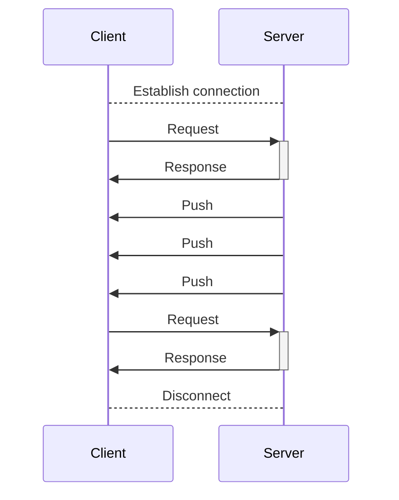
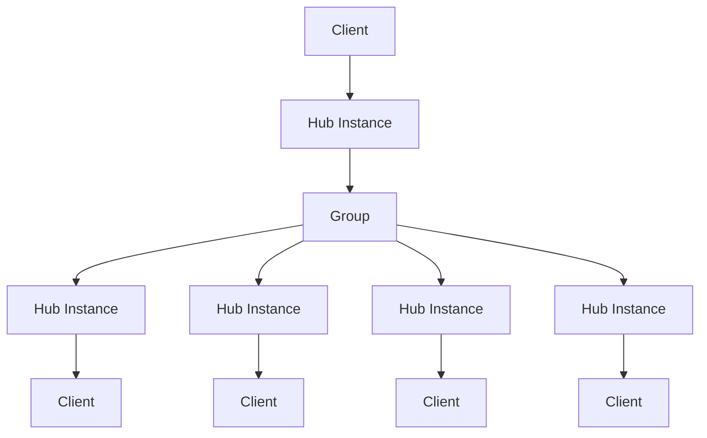
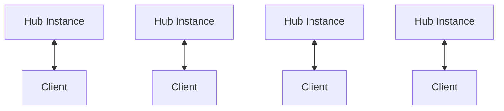

# StreamingHub service fundamentals

StreamingHub is a mechanism for real-time communication between servers and clients using RPC-style communication.

StreamingHub can not only call methods on the server from the client, but also send messages from the server to the client. It is used for receiving messages in chat applications and synchronizing player position information in real-time games.

StreamingHub maintains a connection to the client on the server, and can send messages to the client at any time. The client of StreamingHub has the role of receiving messages from the server and is called a **receiver**.

Unlike Unary, SteramingHub is treated as a single long HTTP request from connection to disconnection at the infrastructure level and ASP.NET Core level.

## Calling multiple clients at once

StreamingHub has a feature to send messages to multiple clients (receivers) at once. This is called a **Group**. A group is a mechanism for bundling multiple clients, and clients can belong to multiple groups. For more information, see [Group](group).

## Server-side StreamingHub instances
The StreamingHub instance on the server is created for each client connection. These instances are not shared between clients. You can use this feature to keep client-specific state in the fields of the StreamingHub instance.

1 Hub instance is created on the server for each client connection. The Hub instance is destroyed when the client is disconnected. Once the Hub is destroyed, it cannot be resumed. After disconnection is detected, you need to establish a connection again.

:::tip
The state of the user when reconnecting must be managed by the application. For example, you need to implement processes such as restoring or continuing user information when reconnecting using the user ID. Also, there is no guarantee that the server will detect disconnection when the client detects disconnection. For more information about disconnection events, see [Handling disconnections](disconnection).
:::

## Hub method processing order

The Hub method calls on a StreamingHub instance are guaranteed to be processed in the order in which they are called by the clients connected to that instance. This means that multiple calls from clients are not executed simultaneously.

:::info
This is a principle for each StreamingHub instance, not a guarantee of processing order for the entire server. Since calls from other clients may be executed simultaneously, application-level consistency of the server's internal state must be ensured.
:::

```mermaid
gantt
    title Timeline
    dateFormat X
    axisFormat %s
    section MethodA
    Invoke   : 0, 1
    section MethodA
    Process   :active, 1, 3

    section MethodB
    Invoke   : 1, 2
    section MethodB
    Process   :active, 3, 5

    section MethodC
    Invoke   : 2, 3
    section MethodC
    Process   :active, 5, 7
```

StreamingHub method calls have the following characteristics:

- A Hub instance's Hub method call is always sequential
- A Hub instance's Hub method is never executed simultaneously
- The order of calls from clients is always maintained
- Calls from clients are never lost

You should be aware that if you wait for other Hub method calls from the same client in a Hub method, you may encounter a deadlock. This is because Hub method calls are always sequential and never executed simultaneously.

Method calls are never lost. StreamingHub processes the calls in the order in which the clients called them. For example, if MethodA, MethodB, and MethodC are called, MethodB will never be missed.

However, it is possible that you will not always receive the results due to disconnection, etc. This means that if MethodA, MethodB, and MethodC are called, the server will continue to wait for processing/execution, but if the client is disconnected, the results after MethodB will not be received.
