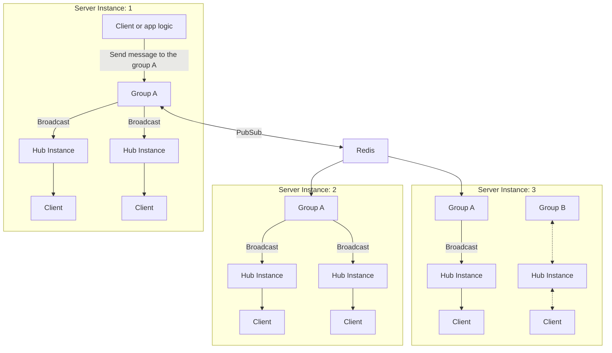

# Connect groups with Redis or NATS
You can connect groups between multiple server instances using Redis or NATS. This is equivalent to the backplane of SignalR.

By using this mechanism, you can send messages to clients belonging to a specific group regardless of the server instance. This allows you to build an architecture that can scale out the server.



## Connect groups with Redis

To use Redis, install the `MagicOnion.Server.Redis` package.

```shell
dotnet add package MagicOnion.Server.Redis
```

Next, set up to use Redis by using the `UseRedisGroup` method on the builder returned by `AddMagicOnion`.

```csharp
builder.Services.AddMagicOnion()
    .UseRedisGroup(options =>
    {
        //options.ConnectionString = "localhost:6379";
        //options.ConnectionMultiplexer = ConnectionMultiplexer.Connect("localhost:6379");
    });
```

The `UseRedisGroup` method has an optional argument to specify whether to use the default group provider. Specify `true` if you want to use the default group provider. If not specified or `false` is specified, you need to specify the group provider for each StreamingHub using the `[GroupConfiguration]` attribute.

```csharp
[GroupConfiguration(typeof(RedisGroupProvider))]
public class MyStreamingHub : StreamingHubBase<IMyStreamingHub, IMyStreamingHubReceiver>, IMyStreamingHub
{
    // ...
}
```

## Connect groups with NATS (Preview)

NATS support is currently in preview and is provided as a package for Multicaster. To use NATS, install the `Multicaster.Distributed.Nats` package.

```shell
dotnet add package Multicaster.Distributed.Nats
```

Next, register `NatsGroupOptions` with the service.

```csharp
builder.Services.AddSingleton<NatsGroupOptions>(new NatsGroupOptions() { Url = "nats://localhost:4222" });
```

Specify the group provider to use NATS in StreamingHub by using the `[GroupConfiguration]` attribute.

```csharp
[GroupConfiguration(typeof(NatsGroupProvider))]
public class MyStreamingHub : StreamingHubBase<IMyStreamingHub, IMyStreamingHubReceiver>, IMyStreamingHub
{
    // ...
}
```

If you want to use NATS as the default group provider, replace `IMulticastGroupProvider` as follows.

```csharp
builder.Services.RemoveAll<IMulticastGroupProvider>();
builder.Services.AddSingleton<IMulticastGroupProvider, NatsGroupProvider>();
```

## Limitations

- Client results are not supported
- `Count`, `CountAsync` methods are not supported
