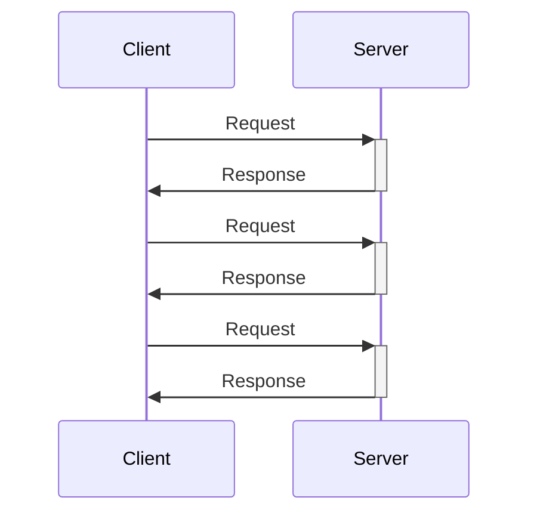

# Unary service fundamentals

Unary services are an implementation method that provides request/response APIs in the style of RPC or Web APIs, and are implemented as gRPC Unary calls. At the infrastructure level, requests can be observed as gRPC over HTTP/2 requests, and are treated as a single HTTP request on ASP.NET Core.

Unary services that implement Unary methods play a role similar to ASP.NET Core MVC or Web API controllers.

