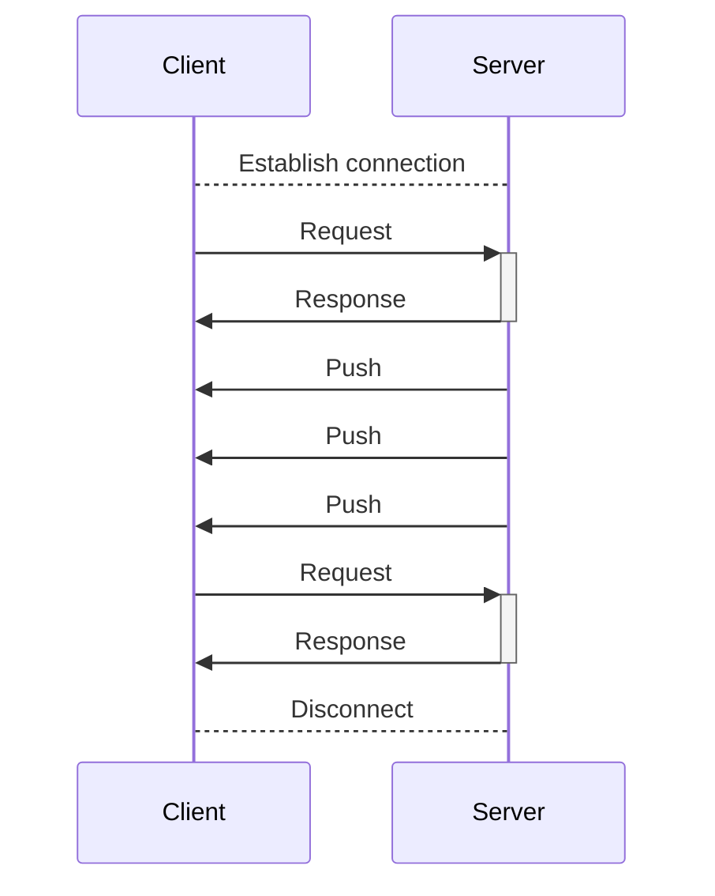
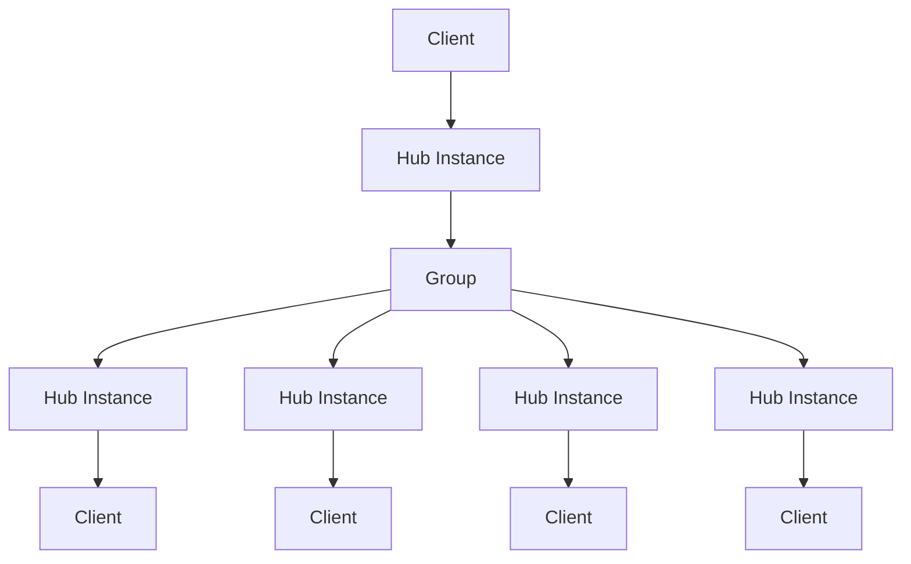
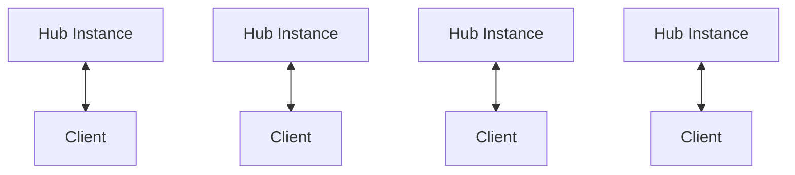

# StreamingHub の基礎

StreamingHub はサーバーとクライアント間でリアルタイム通信を行うための RPC スタイルのメカニズムです。

StreamingHub はクライアントからサーバーのメソッドを呼び出すことができるだけでなく、サーバーからクライアントにメッセージを送信することもできます。例えば、チャットアプリでのメッセージ受信やリアルタイムゲームでのプレイヤー位置情報の同期に使用されます。



StreamingHub はサーバー上でクライアントへの接続を保持し、クライアントからのリクエストとレスポンスの処理だけでなく、サーバー側の任意のタイミングでクライアントへメッセージを送信できます。StreamingHub のクライアントはサーバーからのメッセージを受け取る役割を持つため **レシーバー** と呼ばれます。

## 複数クライアントの一斉呼び出し

StreamingHub には複数のクライアント (レシーバー) に対して一斉にメッセージを送信するための機能があります。これを **グループ** と呼びます。グループは複数のクライアントを束ねるための仕組みで、クライアントは複数のグループに所属することができます。詳しくは [グループ](group) を参照してください。




## サーバー上の StreamingHub インスタンス
サーバー上の StreamingHub のインスタンスは各クライアントの接続ごとに作成されます。これらのインスタンスはクライアント間で共有されません。



クライアント1接続に対してサーバー上では1 Hub インスタンスが作成され、クライアントが切断されたタイミングで破棄されます。この時破棄された Hub を再開することはできません。切断が検知された後は新しい接続を確立する必要があります。

:::tip
再接続時のユーザーのステートはアプリケーションで適切に管理する必要があります。例えばユーザー ID を使用して再接続時のユーザー情報の復元や継続といった処理を実装する必要があります。また、クライアントが切断を検知した際にサーバー上でも切断を検知している保証はありません。切断イベントについて詳しくは[切断のハンドリング](disconnection)を参照してください。
:::

<!--

## Example

The following code is a simple example of a game implementation using StreamingHub and Unity.

```csharp
// Server -> Client definition
public interface IGamingHubReceiver
{
    // The method must have a return type of `void` and can have up to 15 parameters of any type.
    void OnJoin(Player player);
    void OnLeave(Player player);
    void OnMove(Player player);
}

// Client -> Server definition
// implements `IStreamingHub<TSelf, TReceiver>`  and share this type between server and client.
public interface IGamingHub : IStreamingHub<IGamingHub, IGamingHubReceiver>
{
    // The method must return `ValueTask`, `ValueTask<T>`, `Task` or `Task<T>` and can have up to 15 parameters of any type.
    ValueTask<Player[]> JoinAsync(string roomName, string userName, Vector3 position, Quaternion rotation);
    ValueTask LeaveAsync();
    ValueTask MoveAsync(Vector3 position, Quaternion rotation);
}

// for example, request object by MessagePack.
[MessagePackObject]
public class Player
{
    [Key(0)]
    public string Name { get; set; }
    [Key(1)]
    public Vector3 Position { get; set; }
    [Key(2)]
    public Quaternion Rotation { get; set; }
}
```

```csharp
// Server implementation
// implements : StreamingHubBase<THub, TReceiver>, THub
public class GamingHub : StreamingHubBase<IGamingHub, IGamingHubReceiver>, IGamingHub
{
    // this class is instantiated per connected so fields are cache area of connection.
    IGroup room;
    Player self;
    IInMemoryStorage<Player> storage;

    public async ValueTask<Player[]> JoinAsync(string roomName, string userName, Vector3 position, Quaternion rotation)
    {
        self = new Player() { Name = userName, Position = position, Rotation = rotation };

        // Group can bundle many connections and it has inmemory-storage so add any type per group.
        (room, storage) = await Group.AddAsync(roomName, self);

        // Typed Server->Client broadcast.
        Broadcast(room).OnJoin(self);

        return storage.AllValues.ToArray();
    }

    public async ValueTask LeaveAsync()
    {
        await room.RemoveAsync(this.Context);
        Broadcast(room).OnLeave(self);
    }

    public async ValueTask MoveAsync(Vector3 position, Quaternion rotation)
    {
        self.Position = position;
        self.Rotation = rotation;
        Broadcast(room).OnMove(self);
    }

    // You can hook OnConnecting/OnDisconnected by override.
    protected override ValueTask OnDisconnected()
    {
        // on disconnecting, if automatically removed this connection from group.
        return ValueTask.CompletedTask;
    }
}
```

You can write client like this.

```csharp
public class GamingHubClient : IGamingHubReceiver
{
    Dictionary<string, GameObject> players = new Dictionary<string, GameObject>();

    IGamingHub client;

    public async ValueTask<GameObject> ConnectAsync(ChannelBase grpcChannel, string roomName, string playerName)
    {
        this.client = await StreamingHubClient.ConnectAsync<IGamingHub, IGamingHubReceiver>(grpcChannel, this);

        var roomPlayers = await client.JoinAsync(roomName, playerName, Vector3.zero, Quaternion.identity);
        foreach (var player in roomPlayers)
        {
            (this as IGamingHubReceiver).OnJoin(player);
        }

        return players[playerName];
    }

    // methods send to server.

    public ValueTask LeaveAsync()
    {
        return client.LeaveAsync();
    }

    public ValueTask MoveAsync(Vector3 position, Quaternion rotation)
    {
        return client.MoveAsync(position, rotation);
    }

    // dispose client-connection before channel.ShutDownAsync is important!
    public Task DisposeAsync()
    {
        return client.DisposeAsync();
    }

    // You can watch connection state, use this for retry etc.
    public Task WaitForDisconnect()
    {
        return client.WaitForDisconnect();
    }

    // Receivers of message from server.

    void IGamingHubReceiver.OnJoin(Player player)
    {
        Debug.Log("Join Player:" + player.Name);

        var cube = GameObject.CreatePrimitive(PrimitiveType.Cube);
        cube.name = player.Name;
        cube.transform.SetPositionAndRotation(player.Position, player.Rotation);
        players[player.Name] = cube;
    }

    void IGamingHubReceiver.OnLeave(Player player)
    {
        Debug.Log("Leave Player:" + player.Name);

        if (players.TryGetValue(player.Name, out var cube))
        {
            GameObject.Destroy(cube);
        }
    }

    void IGamingHubReceiver.OnMove(Player player)
    {
        Debug.Log("Move Player:" + player.Name);

        if (players.TryGetValue(player.Name, out var cube))
        {
            cube.transform.SetPositionAndRotation(player.Position, player.Rotation);
        }
    }
}
```
-->
