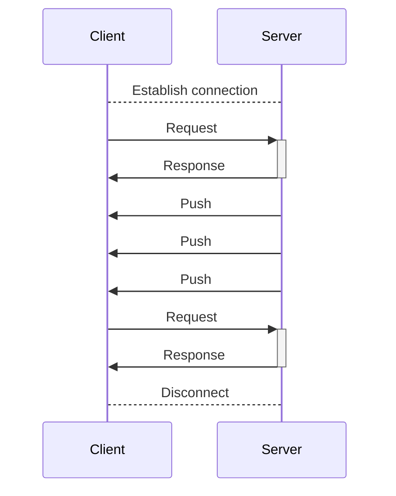
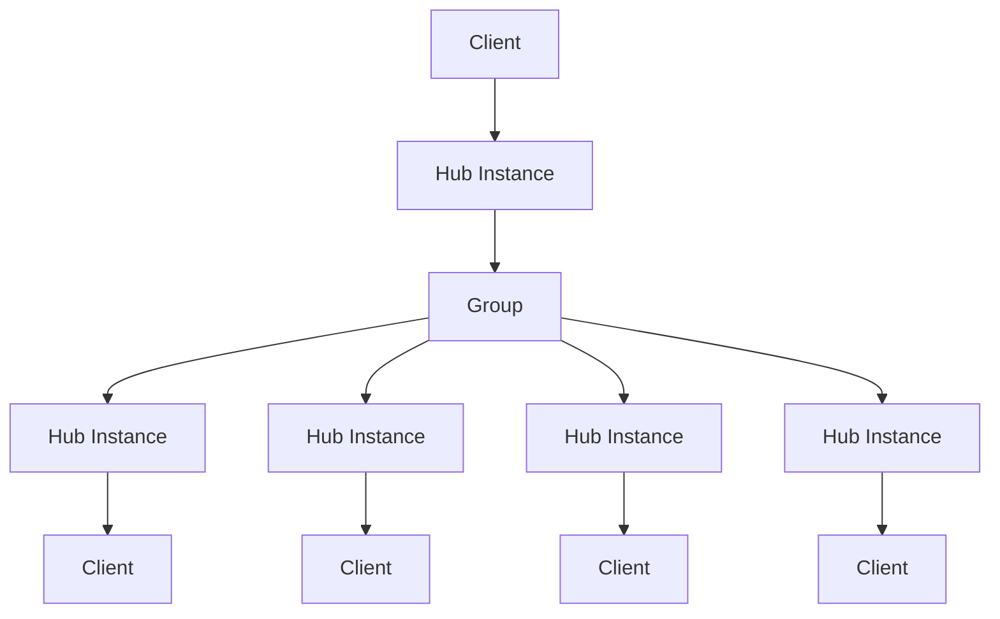
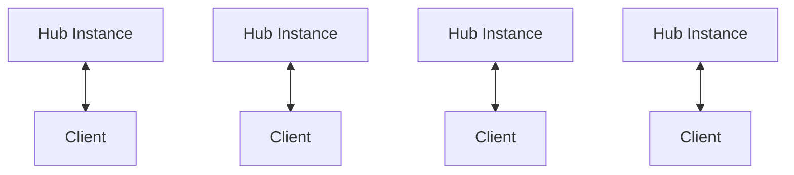

# StreamingHub の基礎

StreamingHub はサーバーとクライアント間でリアルタイム通信を行うための RPC スタイルのメカニズムです。

StreamingHub はクライアントからサーバーのメソッドを呼び出すことができるだけでなく、サーバーからクライアントにメッセージを送信することもできます。例えば、チャットアプリでのメッセージ受信やリアルタイムゲームでのプレイヤー位置情報の同期に使用されます。

StreamingHub はサーバー上でクライアントへの接続を保持し、クライアントからのリクエストとレスポンスの処理だけでなく、サーバー側の任意のタイミングでクライアントへメッセージを送信できます。StreamingHub のクライアントはサーバーからのメッセージを受け取る役割を持つため **レシーバー** と呼ばれます。

## 複数クライアントの一斉呼び出し

StreamingHub には複数のクライアント (レシーバー) に対して一斉にメッセージを送信するための機能があります。これを **グループ** と呼びます。グループは複数のクライアントを束ねるための仕組みで、クライアントは複数のグループに所属することができます。詳しくは [グループ](group) を参照してください。

## サーバー上の StreamingHub インスタンス
サーバー上の StreamingHub のインスタンスは各クライアントの接続ごとに作成されます。これらのインスタンスはクライアント間で共有されません。この特徴を利用して、StreamingHub のインスタンスのフィールドにはクライアントごとのステートを保持できます。

クライアント1接続に対してサーバー上では1 Hub インスタンスが作成され、クライアントが切断されたタイミングで破棄されます。この時破棄された Hub を再開することはできません。切断が検知された後は新しい接続を確立する必要があります。

:::tip
再接続時のユーザーのステートはアプリケーションで適切に管理する必要があります。例えばユーザー ID を使用して再接続時のユーザー情報の復元や継続といった処理を実装する必要があります。また、クライアントが切断を検知した際にサーバー上でも切断を検知している保証はありません。切断イベントについて詳しくは[切断のハンドリング](disconnection)を参照してください。
:::

## 処理順序

StreamingHub のインスタンスの Hub メソッドの呼び出しは、そのインスタンスに接続しているクライアントからの呼び出し順に処理されることが保証されます。これはクライアントからの複数の呼び出しは同時に実行されないということを意味します。

:::info
これは StreamingHub のインスタンス、つまり接続ごとの原則であり、サーバー全体での処理順序を保証するものではありません。他のクライアントからの呼び出しは同時に実行される可能性があるため、サーバーの内部状態に関する一貫性はアプリケーションで保証する必要があります。
:::

```mermaid
gantt
    title Timeline
    dateFormat X
    axisFormat %s
    section MethodA
    Invoke   : 0, 1
    section MethodA
    Process   :active, 1, 3

    section MethodB
    Invoke   : 1, 2
    section MethodB
    Process   :active, 3, 5

    section MethodC
    Invoke   : 2, 3
    section MethodC
    Process   :active, 5, 7
```

StreamingHub のメソッド呼び出しは下記のような特徴を持ちます:

- 一つの Hub インスタンスの Hub メソッド呼び出しは常にシーケンシャル
- 一つの Hub インスタンスの Hub メソッドが同時に実行されることはない
- 常にクライアントが呼び出した順に呼び出される
- クライアントからの呼び出しが欠落することはない

シーケンシャルかつ同時に呼び出されないという特徴から Hub メソッドの中で同一クライアントによる他の Hub メソッド呼び出しを待ち合わせるといった処理を行うとデッドロックする点に注意が必要です。

メソッドの呼び出しは欠落することはありません。これは StreamingHub はクライアントが呼び出した順序で処理するためです。MethodA, MethodB, MethodC と呼び出して MethodB のみ呼び出されないということは発生しません。ただし、呼び出しとは別に常に切断などで結果を受け取れない可能性があります。これは MethodA, MethodB, MethodC と呼び出した場合、サーバー上では処理を待機/実行継続しているがクライアントが切断された場合は MethodB 以降の結果を受け取れないといったケースです。
