# 処理順序

StreamingHub のインスタンスの Hub メソッドの呼び出しは、そのインスタンスに接続しているクライアントからの呼び出し順に処理されることが保証されます。これはクライアントからの複数の呼び出しは同時に実行されないということを意味します。

:::info
これは StreamingHub のインスタンス、つまり接続ごとの原則であり、サーバー全体での処理順序を保証するものではありません。他のクライアントからの呼び出しは同時に実行される可能性があるため、サーバーの内部状態に関する一貫性はアプリケーションで保証する必要があります。
:::

```mermaid
gantt
    title Timeline
    dateFormat X
    axisFormat %s
    section MethodA
    Invoke   : 0, 1
    section MethodA
    Process   :active, 1, 3

    section MethodB
    Invoke   : 1, 2
    section MethodB
    Process   :active, 3, 5

    section MethodC
    Invoke   : 2, 3
    section MethodC
    Process   :active, 5, 7
```

StreamingHub のメソッド呼び出しは下記のような特徴を持ちます:

- 一つの Hub インスタンスの Hub メソッド呼び出しは常にシーケンシャル
- 一つの Hub インスタンスの Hub メソッドが同時に実行されることはない
- 常にクライアントが呼び出した順に呼び出される
- クライアントからの呼び出しが欠落することはない

シーケンシャルかつ同時に呼び出されないという特徴から Hub メソッドの中で同一クライアントによる他の Hub メソッド呼び出しを待ち合わせるといった処理を行うとデッドロックする点に注意が必要です。

メソッドの呼び出しは欠落することはありません。これは StreamingHub はクライアントが呼び出した順序で処理するためです。MethodA, MethodB, MethodC と呼び出して MethodB のみ呼び出されないということは発生しません。ただし、呼び出しとは別に常に切断などで結果を受け取れない可能性があります。これは MethodA, MethodB, MethodC と呼び出した場合、サーバー上では処理を待機/実行継続しているがクライアントが切断された場合は MethodB 以降の結果を受け取れないといったケースです。
