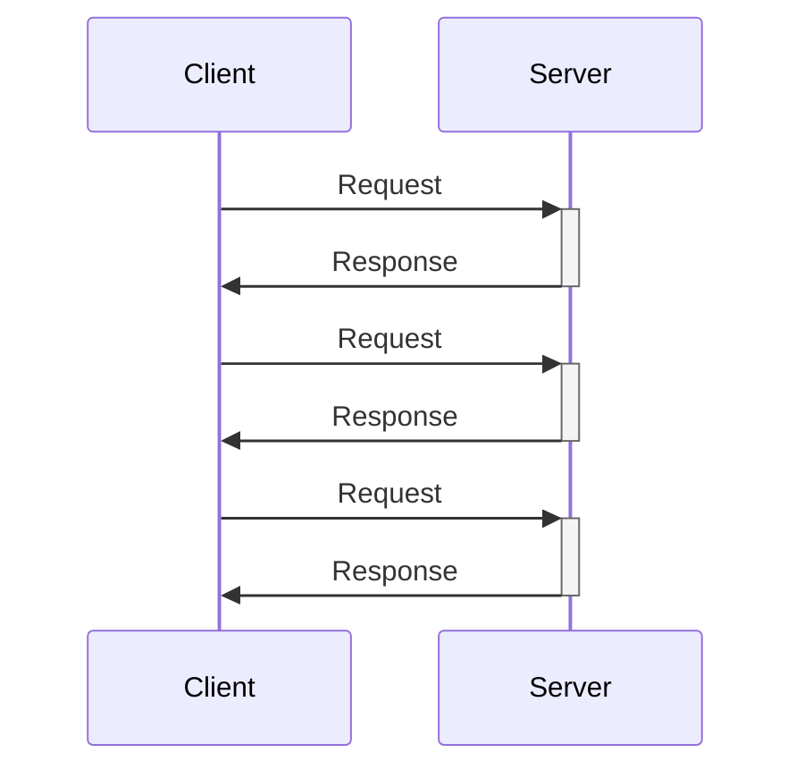

# Unary の基礎

Unary サービスは、RPC や Web-API のスタイルでリクエスト/レスポンス API を提供する実装方式であり、gRPC の Unary コールとして実装されます。インフラストラクチャーレベルではリクエストは gRPC over HTTP/2 のリクエストとして観測できます。

Unary のメソッドを実装する Unary サービスは ASP.NET Core MVC や Web API のコントローラーのような役目を担います。
