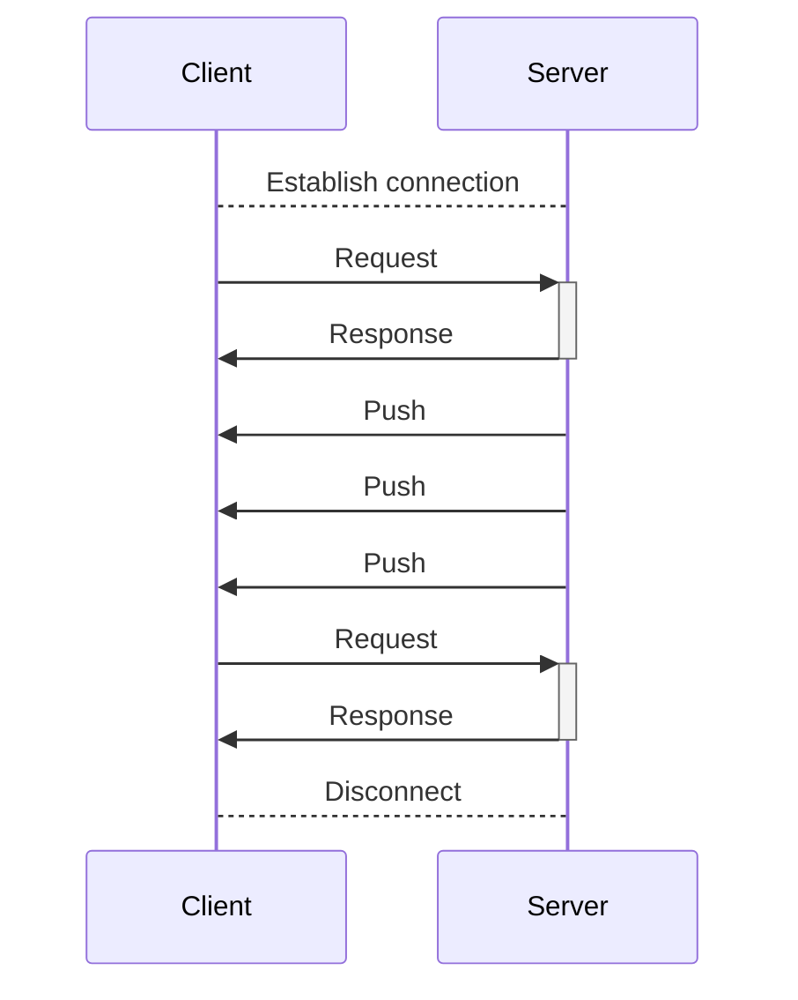
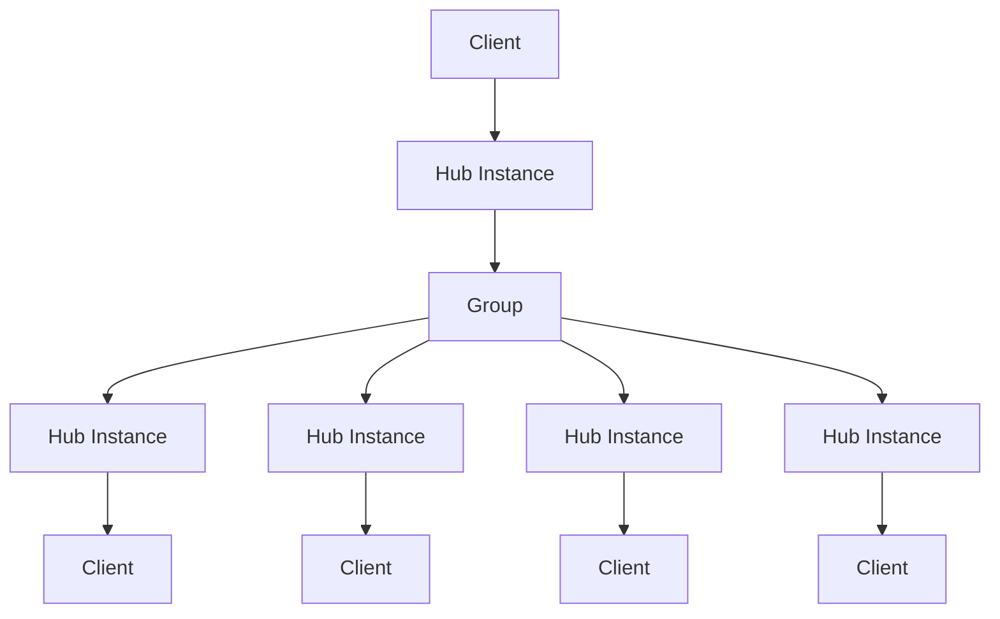
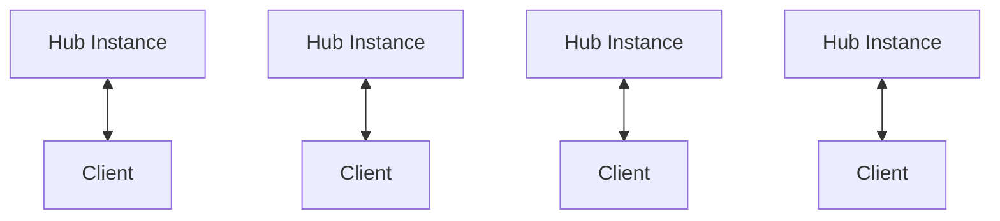

# StreamingHub 서비스 기본 사항

StreamingHub는 RPC 스타일 통신을 사용하여 서버와 클라이언트 간의 실시간 통신을 위한 메커니즘입니다.

StreamingHub는 클라이언트에서 서버의 메서드를 호출할 수 있을 뿐만 아니라, 서버에서 클라이언트로 메시지를 전송할 수도 있습니다. 예를 들어, 채팅 앱에서의 메시지 수신이나 실시간 게임에서의 플레이어 위치 정보 동기화에 사용됩니다.

StreamingHub는 서버에서 클라이언트와의 연결을 유지하며, 언제든지 클라이언트에게 메시지를 보낼 수 있습니다. StreamingHub의 클라이언트는 서버로부터 메시지를 수신하는 역할을 하며 **수신자**(Receiver)라고 불립니다.

Unary와 달리, StreamingHub는 인프라 수준과 ASP.NET Core 수준에서 연결부터 연결 해제까지 단일 긴 HTTP 요청으로 취급됩니다.

## 여러 클라이언트를 한 번에 호출하기

StreamingHub는 여러 클라이언트(수신자)에게 한 번에 메시지를 보내는 기능이 있습니다. 이를 **그룹**이라고 합니다. 그룹은 여러 클라이언트를 묶는 메커니즘이며, 클라이언트는 여러 그룹에 속할 수 있습니다. 자세한 내용은 [그룹](group) 페이지를 참조하시기 바랍니다.

## 서버 측 StreamingHub 인스턴스
서버의 StreamingHub 인스턴스는 각 클라이언트 연결마다 생성됩니다. 이러한 인스턴스들은 클라이언트 간에 공유되지 않습니다. 이 기능을 사용하여 StreamingHub 인스턴스의 필드에 클라이언트별 상태를 유지할 수 있습니다.

클라이언트 연결마다 Hub 인스턴스가 서버에 생성됩니다. Hub 인스턴스는 클라이언트가 연결 해제될 때 파괴됩니다. Hub가 한번 파괴되면, 다시 시작할 수 없습니다. 연결 해제가 감지된 후에는 다시 연결을 설정해야 합니다.

:::tip
재연결 시 사용자의 상태는 애플리케이션에서 관리해야 합니다. 예를 들어, 사용자 ID를 사용하여 재연결할 때 사용자 정보를 복원하거나 계속하는 등의 프로세스를 구현해야 합니다. 또한, 클라이언트가 연결 해제를 감지할 때 서버가 연결 해제를 감지한다는 보장은 없습니다. 연결 해제 이벤트에 대한 자세한 내용은 [연결 해제 처리](disconnection) 페이지를 참조하시기 바랍니다.
:::

## Hub 메서드 처리 순서

StreamingHub 인스턴스의 Hub 메서드 호출은 해당 인스턴스에 연결된 클라이언트가 호출한 순서대로 처리되는 것이 보장됩니다. 이는 클라이언트로부터의 여러 호출이 동시에 실행되지 않는다는 것을 의미합니다.

:::info
이는 각 StreamingHub 인스턴스에 대한 원칙이며, 서버 전체의 처리 순서에 대한 보장은 아닙니다. 다른 클라이언트로부터의 호출이 동시에 실행될 수 있으므로, 서버의 내부 상태에 대한 애플리케이션 수준의 일관성은 보장되어야 합니다.
:::

```mermaid
gantt
    title Timeline
    dateFormat X
    axisFormat %s
    section MethodA
    Invoke   : 0, 1
    section MethodA
    Process   :active, 1, 3

    section MethodB
    Invoke   : 1, 2
    section MethodB
    Process   :active, 3, 5

    section MethodC
    Invoke   : 2, 3
    section MethodC
    Process   :active, 5, 7
```

StreamingHub의 메서드 호출은 다음과 같은 특징을 가집니다:

- 하나의 Hub 인스턴스의 Hub 메서드 호출은 항상 순차적 입니다.
- 하나의 Hub 인스턴스의 Hub 메서드가 동시에 실행되는 일은 없습니다.
- 항상 클라이언트가 호출한 순서대로 호출됩니다.
- 클라이언트로부터의 호출이 누락되는 일은 없습니다.

Hub 메서드 내에서 동일한 클라이언트의 다른 Hub 메서드 호출을 기다리면 교착 상태가 발생할 수 있다는 점을 알아야 합니다. 이는 Hub 메서드 호출이 항상 순차적이며 절대 동시에 실행되지 않기 때문입니다.

메서드 호출은 절대 손실되지 않습니다. StreamingHub는 클라이언트가 호출한 순서대로 호출을 처리합니다. 예를 들어, MethodA, MethodB, MethodC가 호출된 경우, MethodB가 누락되는 일은 절대 없습니다.

하지만 연결 해제 등으로 인해 결과를 받지 못할 수 있습니다. 이는 MethodA, MethodB, MethodC가 호출된 경우, 서버는 계속해서 처리/실행을 기다리지만, 클라이언트가 연결 해제되면 MethodB 이후의 결과를 받지 못한다는 것을 의미합니다.
