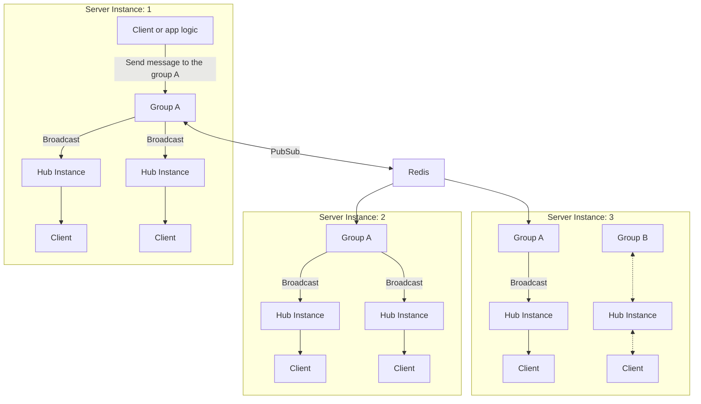

# グループを Redis や NATS で接続する
MagicOnion のグループは Redis や NATS を使用して複数のサーバーインスタンス間で接続できます。これは SignalR のバックプレーンに相当する仕組みです。

この仕組みを使用するとサーバーのインスタンスを問わず、特定の名前のグループに所属しているクライアントに対してメッセージを送信できます。これによりサーバーのスケールアウトが可能なアーキテクチャーを構築できます。



## Redis を使用する

Redis を使用する場合は `MagicOnion.Server.Redis` パッケージをインストールします。

```shell
dotnet add package MagicOnion.Server.Redis
```

次に `AddMagicOnion` で返されるビルダーに対して `UseRedisGroup` メソッドを使用して Redis を使用するよう設定します。

```csharp
builder.Services.AddMagicOnion()
    .UseRedisGroup(options =>
    {
        //options.ConnectionString = "localhost:6379";
        //options.ConnectionMultiplexer = ConnectionMultiplexer.Connect("localhost:6379");
    });
```

`UseRedisGroup` メソッドはオプション引数としてデフォルトのグループプロバイダーとするかどうかを指定する引数があります。デフォルトのグループプロバイダーとする場合は `true` を指定します。省略した場合や `false` を指定した場合は StreamingHub ごとに `[GroupConfiguration]` 属性を使用してグループプロバイダーを指定する必要があります。

```csharp
[GroupConfiguration(typeof(RedisGroupProvider))]
public class MyStreamingHub : StreamingHubBase<IMyStreamingHub, IMyStreamingHubReceiver>, IMyStreamingHub
{
    // ...
}
```

## NATS を使用する (プレビュー)

NATS のサポートは現時点でプレビューであり、Multicaster のパッケージとして提供されます。 NATS を使用するには `Multicaster.Distributed.Nats` パッケージをインストールします。

```shell
dotnet add package Multicaster.Distributed.Nats
```

次にサービスに `NatsGroupOptions` を登録します。

```csharp
builder.Services.AddSingleton<NatsGroupOptions>(new NatsGroupOptions() { Url = "nats://localhost:4222" });
```

NATS を使用するグループを使う StreamingHub で `[GroupConfiguration]` 属性を使用してグループプロバイダーを指定します。

```csharp
[GroupConfiguration(typeof(NatsGroupProvider))]
public class MyStreamingHub : StreamingHubBase<IMyStreamingHub, IMyStreamingHubReceiver>, IMyStreamingHub
{
    // ...
}
```

デフォルトのグループプロバイダーとしたい場合は以下のように `IMulticastGroupProvier` を入れ替えます。

```csharp
builder.Services.RemoveAll<IMulticastGroupProvider>();
builder.Services.AddSingleton<IMulticastGroupProvider, NatsGroupProvider>();
```

## 制限事項

- クライアント結果はサポートされません
- `Count`, `CountAsync` メソッドはサポートされません
