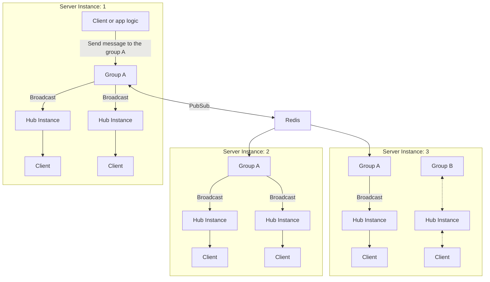

# 그룹을 Redis나 NATS로 연결하기
MagicOnion의 그룹은 Redis나 NATS를 사용하여 복수의 서버 인스턴스 간에 연결할 수 있습니다. 이는 SignalR의 backplane에 해당하는 구조입니다.

이 구조를 사용하면 서버의 인스턴스와 관계없이, 특정 이름의 그룹에 소속되어 있는 클라이언트에 대해서 메시지를 송신할 수 있습니다. 이를 통해 서버의 스케일아웃이 가능한 아키텍처를 구축할 수 있습니다.



## Redis 사용하기

Redis를 사용하는 경우는 `MagicOnion.Server.Redis` 패키지를 설치합니다.

```shell
dotnet add package MagicOnion.Server.Redis
```

다음으로 `AddMagicOnion`으로 반환되는 빌더에 대해서 `UseRedisGroup` 메소드를 사용하여 Redis를 사용하도록 설정합니다.

```csharp
builder.Services.AddMagicOnion()
    .UseRedisGroup(options =>
    {
        //options.ConnectionString = "localhost:6379";
        //options.ConnectionMultiplexer = ConnectionMultiplexer.Connect("localhost:6379");
    });
```

`UseRedisGroup` 메소드는 옵션 인자로서 기본 group provider로 할지 여부를 지정하는 인자가 있습니다. 기본 group provider로 하는 경우는 `true`를 지정합니다. 생략한 경우나 `false`를 지정한 경우는 StreamingHub마다 `[GroupConfiguration]` 속성을 사용하여 group provider를 지정할 필요가 있습니다.

```csharp
[GroupConfiguration(typeof(RedisGroupProvider))]
public class MyStreamingHub : StreamingHubBase<IMyStreamingHub, IMyStreamingHubReceiver>, IMyStreamingHub
{
    // ...
}
```

## NATS 사용하기 (Preview)

NATS의 지원은 현시점에서 Preview이며, Multicaster의 패키지로서 제공됩니다. NATS를 사용하려면 `Multicaster.Distributed.Nats` 패키지를 설치합니다.

```shell
dotnet add package Multicaster.Distributed.Nats
```

다음으로 서비스에 `NatsGroupOptions`를 등록합니다.

```csharp
builder.Services.AddSingleton<NatsGroupOptions>(new NatsGroupOptions() { Url = "nats://localhost:4222" });
```

NATS를 사용하는 그룹을 사용하는 StreamingHub에서 `[GroupConfiguration]` 속성을 사용하여 group provider를 지정합니다.

```csharp
[GroupConfiguration(typeof(NatsGroupProvider))]
public class MyStreamingHub : StreamingHubBase<IMyStreamingHub, IMyStreamingHubReceiver>, IMyStreamingHub
{
    // ...
}
```

기본 group provider로 하고 싶은 경우는 다음과 같이 `IMulticastGroupProvier`를 교체합니다.

```csharp
builder.Services.RemoveAll<IMulticastGroupProvider>();
builder.Services.AddSingleton<IMulticastGroupProvider, NatsGroupProvider>();
```

## 제한 사항

- 클라이언트 결과는 지원되지 않습니다
- `Count`, `CountAsync` 메소드는 지원되지 않습니다
