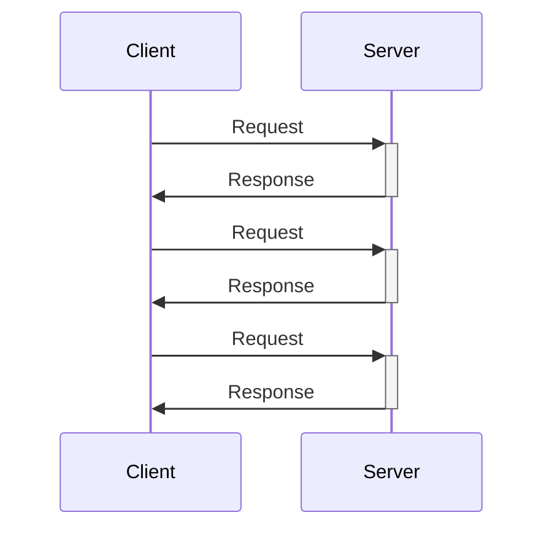

# Unary 서비스 기본 사항

Unary 서비스는 RPC 또는 Web API 스타일의 요청(Request)/응답(Response) API를 제공하는 구현 방식이며, gRPC의 Unary 호출로 구현됩니다. 인프라 수준에서는 HTTP/2 요청을 통한 gRPC로 관찰될 수 있으며, ASP.NET Core에서 단일 HTTP 요청으로 처리됩니다.

Unary 메서드를 구현하는 Unary 서비스는 ASP.NET Core MVC나 Web API의 컨트롤러와 같은 역할을 담당합니다.
